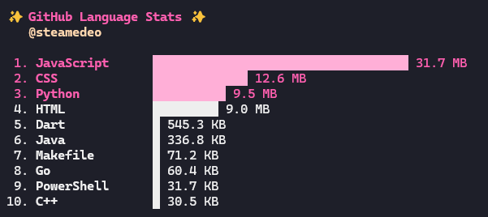

# GitLingo

Checkout your GitHub programming language statistics straight in your terminal.

## Installation

```bash
git clone https://github.com/yourusername/gitlingo.git
cd gitlingo
make build
```

## Setup

1. Create a GitHub Personal Access Token:
   - Go to [GitHub Settings > Developer settings > Personal access tokens > Tokens (classic)](https://github.com/settings/tokens)
   - Click "Generate new token (classic)"
   - Give it a name (e.g., "GitLingo")
   - Select the `repo` scope
   - Click "Generate token"
   - Copy the token (starts with `ghp_`)

2. Create a `.env` file:

   ```bash
   cp .env.example .env
   ```

3. Add your token to the `.env` file:
   ```
   github_token=ghp_yourTokenHere
   ```

## Usage

```bash
./bin/gitlingo languages
```

This will display your top 10 programming languages by total bytes across all your repositories.



## How it works

GitLingo fetches all your GitHub repositories and aggregates language statistics to show you what you code in most.
